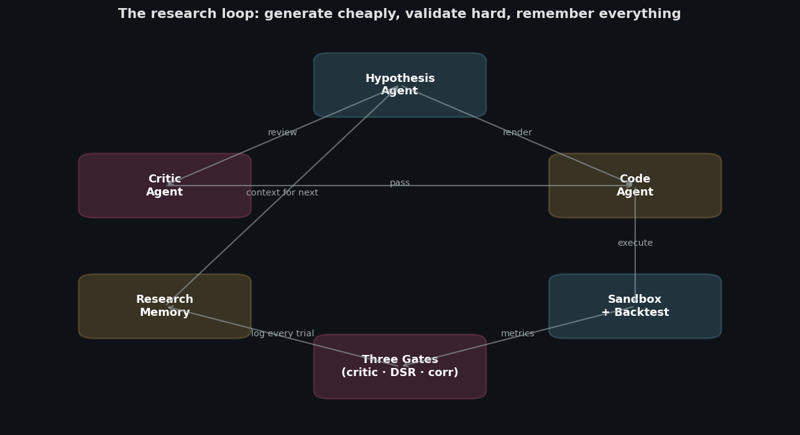
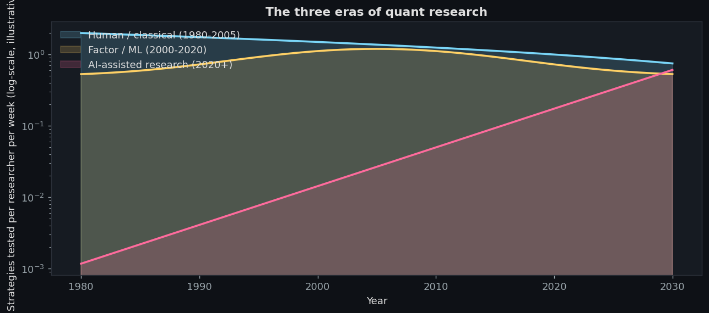
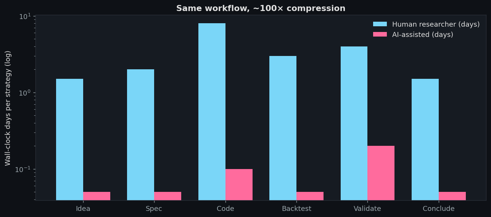
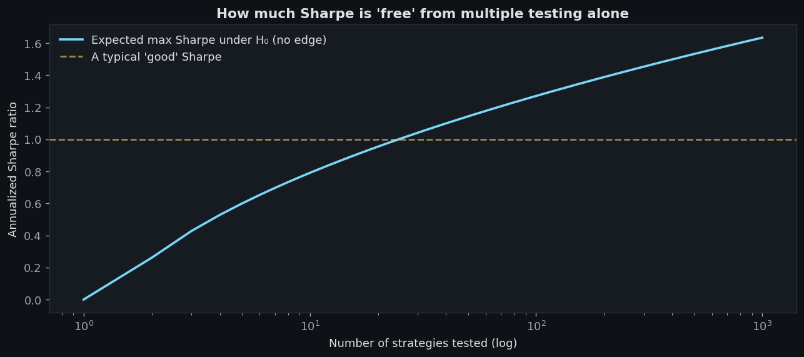
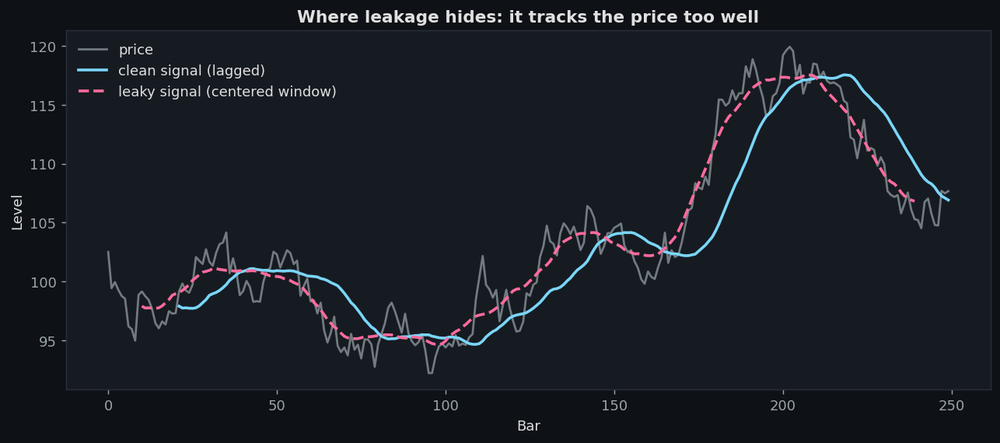
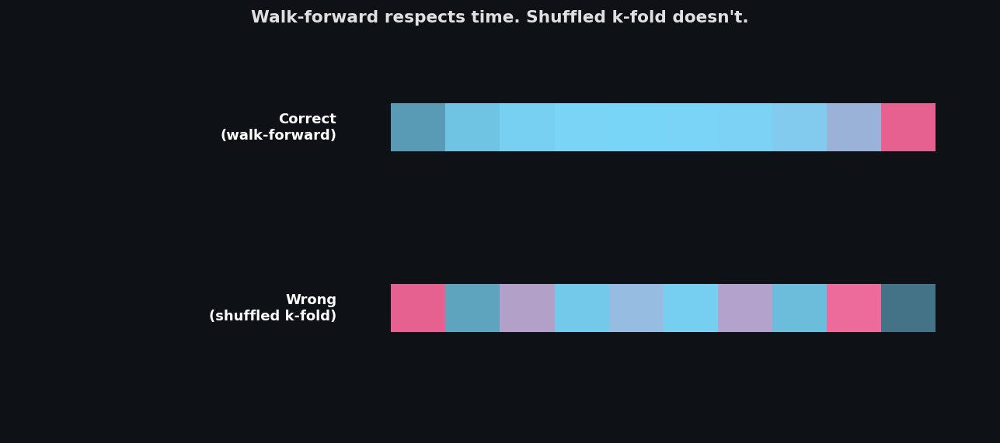

# ai-quant-lab

[](https://www.python.org/downloads/)
[](LICENSE)
[](tests/)
[](https://docs.anthropic.com)

> AI-powered quant research engine. Claude generates strategies; the system validates and kills the bad ones.

---

## Quick start

```bash
git clone https://github.com/yourname/ai-quant-lab
cd ai-quant-lab
python3 -m venv .venv && source .venv/bin/activate
pip install -e ".[dev]"
cp .env.example .env                     # fill in ANTHROPIC_API_KEY (optional for examples 1-5)
python examples/05_deflated_sharpe_demo.py   # see the multiple-testing kill in action
uv run ai_quant_lab --iterations 10 --target 2   # full research loop
uv run .venv/bin/python examples/10_experiment_grid.py
```

That's it. Examples 1-5 run without an API key on synthetic data. Examples
6-8 need a key and exercise the Claude-powered loop.

---

## Architecture



The whole thing is six modules and a CLI. See [docs/ARCHITECTURE.md](docs/ARCHITECTURE.md).

---

## The core loop

```python
from ai_quant_lab.agents.memory import ResearchMemory
from ai_quant_lab.backtest import BacktestConfig
from ai_quant_lab.orchestrator.loop import LoopConfig, run_research_loop

with ResearchMemory("./memory.db") as memory:
    artifacts, survivors = run_research_loop(
        price_data,
        LoopConfig(
            market_description="Daily bars on a single liquid US equity, 10 years.",
            iterations=50,
            target_survivors=3,
            backtest_config=BacktestConfig(cost_bps=8.0),
        ),
        memory=memory,
    )
```

That's the entire user-facing API. Everything tunable goes through env vars
or `LoopConfig`. The full implementation is in
[`ai_quant_lab/orchestrator/loop.py`](ai_quant_lab/orchestrator/loop.py) —
fewer than 200 lines.

---

## Why this exists

Most LLM trading agent frameworks optimize for the demo: a single
end-to-end run that produces a plausible-looking backtest. They skip the
unsexy part: knowing whether the backtest means anything.

The honest answer for most strategies is "no, it doesn't." When you let
Claude propose, code, and backtest a thousand variants, picking the best one
is exactly the recipe for the classic multiple-testing trap. The reported
Sharpe is meaningless. The strategy will not work in production. This is the
problem ai-quant-lab is built around.

The fix is statistical rigor as a hard gate: every accepted strategy passes
an adversarial critic, a deflated Sharpe test parameterized by the honest
trial count, and a correlation check against the existing survivor set. No
overrides. Generation is cheap; validation is expensive; the architecture
puts the expensive part where it belongs.

---

## What's different

| Feature                            | ai-quant-lab          | TradingAgents | AgentQuant | QuantEvolve |
|------------------------------------|-----------------------|---------------|------------|-------------|
| Deflated Sharpe gate               | ✅ Hard gate, empirical trial variance | ❌  | ❌         | ❌          |
| Purged CV                          | ✅ Combinatorial       | ❌            | ❌         | ❌          |
| Leakage detector                   | ✅ Correlation + structural (truncation) | ❌ | ❌ | ❌      |
| Walk-forward                       | ✅ With purge          | ❌            | ❌         | ✅ Basic    |
| Cross-sectional portfolio engine   | ✅ Long-short, dollar-neutral | ❌      | ❌         | ❌          |
| Cross-sectional features           | ✅ Rank, z-score, factor / industry neutralize | ❌ | ❌ | ❌    |
| Meta-labeling                      | ✅ Logistic classifier, act/skip filter | ❌ | ❌    | ❌          |
| Factor attribution                 | ✅ PCA + Fama-French OLS | ❌          | ❌         | ❌          |
| PCA concentration gate             | ✅ Catches stealthy duplication | ❌  | ❌         | ❌          |
| Realistic execution                | ✅ Slippage, partial fills, participation cap | ❌ | ❌ | ❌ |
| TCA framework                      | ✅ Calibrates costs from fills | ❌    | ❌         | ❌          |
| Intraday-aware bar engine          | ✅ BarSchedule auto-annualization | ❌ | ❌      | ❌          |
| OHLCV features                     | ✅ Parkinson, Garman-Klass, VWAP-dev | ❌ | ❌ | ❌      |
| Adversarial critic                 | ✅ Per-market templates (equities/crypto/futures/options/fx) | ❌ | ✅ Reflect | ❌ |
| Memory / trial counting            | ✅ SQLite, persists returns | ❌       | ✅ SQLite  | ✅ Feature map |
| Claude-native                      | ✅ Anthropic SDK + prompt caching | Generic | Gemini | Gemini |
| Production kill-switch             | ✅ Drawdown / loss / Sharpe collapse | ❌ | ❌    | ❌          |
| Paper trading diagnostics          | ✅                     | ❌            | ❌         | ❌          |
| Lines of code                      | ~5000                  | ~5000+        | ~3000+     | ~2000+      |
| Dependencies                       | 5                      | 15+           | 10+        | 10+         |
| Works without API key              | ✅ (examples 1-5, 7-9) | ❌            | ❌         | ❌          |
| Continuous integration             | ✅ (Python 3.11+3.12, ruff) | ❌       | ❌         | ❌          |

---

## The three eras of quant research



Quant has gone through three big shifts. **Classical** (1980-2005) ran on
human intuition and slow hand-coded backtests; one researcher could test
maybe ten strategies a week. **Factor / ML** (2000-2020) industrialized this
with libraries, cloud, and falling compute costs; throughput climbed but the
edge per strategy shrank as the obvious factors got arbitraged.

The **AI-assisted era** changes the throughput equation by another two
orders of magnitude. One person with an Anthropic key can have Claude
propose, code, and backtest a thousand strategies a week. Which means the
binding constraint is no longer ideas. It's the validation gate.

---

## Time compression



The classical research cycle was bottlenecked by coding. A working
backtest took a week; iterating on the spec took another week. Now both
collapse to minutes. The bottleneck moves to the only step that humans
need to be honest about: **knowing whether the result means anything.**

---

## The multiple-testing tax



Run a thousand random strategies on a no-edge tape. The expected maximum
annualized Sharpe is roughly **1.5**. That's the Sharpe of a "good" strategy.
Which is why naïve reports of "we tested a thousand things and the best one
has a Sharpe of 1.4" are noise reports.

The deflated Sharpe ratio penalizes this. See `examples/05_deflated_sharpe_demo.py`
for a live demo: pick the best of 1000 random strategies on GBM, run it
through `deflated_sharpe(returns, n_trials=1000)`, watch the p-value go to
0.62. The strategy doesn't pass the gate. It shouldn't.

---

## Where leakage hides



The most common forms of leakage are not exotic:

1. **Centered rolling windows.** `series.rolling(21, center=True).mean()`
   includes ten future bars in the value at time t. Any feature built on
   this peeks at the future.
2. **Forgotten shifts.** `momentum(price, 21)` without a `.shift(1)` uses
   today's close in today's signal. The strategy can't actually trade on
   today's close until tomorrow's open.
3. **Forward-looking labels used as features.** Triple-barrier labels are
   built to look forward — that's their job as a _target_. Using them as a
   _feature_ is the cleanest possible leak.

The leakage detector (`features/leakage_detector.py`) catches all three
shapes by comparing future and past correlations of every feature against
the target. See [`examples/03_leakage_demo.py`](examples/03_leakage_demo.py).

---

## Walk-forward, the right way



Shuffled k-fold CV is fine for IID data. Time series is not IID. Run
walk-forward (`validation/walk_forward.py`) and set a `purge` gap if your
labels look forward more than one bar. The OOS curve is the only one that
matters.

```python
out = walk_forward_evaluate(
    price_data, strategy,
    train_size=504, test_size=126, purge=5, mode="rolling",
)
print(out["metrics"]["sharpe_ratio"])
```

For a robustness check across overlapping splits, use
`combinatorial_purged_cv` — every bar appears in multiple test sets, which
gives you a distribution of OOS Sharpes rather than a single point.

---

## The three gates

A strategy must pass all three:

1. **Critic.** Adversarial LLM review BEFORE the backtest. Catches the
   obviously broken ideas. One LLM call.
2. **Deflated Sharpe.** P-value below `settings.dsr_pvalue_max` (default
   5%). Parameterized by the honest `n_trials` from `ResearchMemory`. No
   override.
3. **Correlation.** Maximum |correlation| with already-accepted strategies
   below `settings.max_correlation` (default 0.6). Keeps the survivor set
   diverse.

Implementation in [`orchestrator/gates.py`](ai_quant_lab/orchestrator/gates.py).
Full statistical write-up in [`docs/VALIDATION.md`](docs/VALIDATION.md).

---

## Sections from the article

<details>
<summary><b>Why generation is cheap and validation is expensive</b></summary>

The asymmetry is the whole point. Claude can propose a thousand strategies a
day at ~$10. Each requires hundreds of bars of data and seconds of compute to
validate. The throughput equation says: spend cycles validating, not
generating.

Concretely, ai-quant-lab is structured so the cheap step (LLM call) gates
the expensive step (full validation). The critic is one cheap call. The
sandbox is fast. The deflated Sharpe test is a closed-form formula. The
costly part — purged CV across many folds — only runs on strategies that have
already cleared the cheaper checks.
</details>

<details>
<summary><b>The honest n_trials problem</b></summary>

Every parameter sweep counts. Every variant counts. Every "let me just try
one more thing" counts. The deflated Sharpe gate is only as honest as the
trial counter feeding it.

`ResearchMemory` exists to make this counter tamper-evident. Every
hypothesis ever proposed — accepted, rejected, killed by the critic — gets a
row in SQLite. The gate reads `memory.n_trials()` and there's no API to
zero it out.
</details>

<details>
<summary><b>Why prompt caching matters</b></summary>

The system prompts of HypothesisAgent, CriticAgent, and CodeAgent are
invariant across every iteration of the loop. Marking them with
`cache_control: ephemeral` means every call after the first hits the
5-minute cache. On a 50-iteration loop, that's roughly a 10× cost reduction
without changing a single behavior.

See [`agents/base.py`](ai_quant_lab/agents/base.py).
</details>

<details>
<summary><b>The sandbox: catching accidents, not adversaries</b></summary>

The sandbox AST-walks generated code and rejects anything outside `numpy`,
`pandas`, `math`, and `ai_quant_lab.features.library`. The runtime
namespace has a whitelist of builtins — no `open`, no `__import__`, no
`eval`. A SIGALRM enforces a wall-clock timeout.

This is not a security boundary; the LLM running on your machine can write
any code your shell can run. The sandbox stops Claude from writing a
strategy that accidentally `import os; os.system("rm -rf ~")` because of a
hallucination. It does not stop a determined adversary.
</details>

<details>
<summary><b>Live diagnostics and the kill switch</b></summary>

Once a strategy clears the gates, it gets a paper-trade slot. The
`LiveDiagnostic` compares a rolling window of live returns to the backtest
distribution. The `KillSwitch` trips on hard rules (drawdown, daily loss,
rolling Sharpe collapse) and stays tripped until manually reset.

There is no "the strategy was about to recover" override. That's how
blow-ups happen.

```python
from ai_quant_lab.production import KillSwitch, LiveDiagnostic
from ai_quant_lab.production.kill_switch import drawdown_trigger, sharpe_collapse_trigger

diag = LiveDiagnostic(backtest_returns=accepted.returns, window_days=60)
kill = KillSwitch(triggers=[drawdown_trigger(0.10), sharpe_collapse_trigger(-0.5, 60)])
```
</details>

---

## Examples

| File | What it shows | Needs API key? |
|------|---------------|----------------|
| [`01_backtest_basics.py`](examples/01_backtest_basics.py) | Vectorized backtest on synthetic GBM, headline metrics. | No |
| [`02_feature_pipeline.py`](examples/02_feature_pipeline.py) | Building leakage-proof features via FeaturePipeline. | No |
| [`03_leakage_demo.py`](examples/03_leakage_demo.py) | Side-by-side: forward reference, centered rolling, clean. | No |
| [`04_walk_forward.py`](examples/04_walk_forward.py) | Walk-forward on a momentum strategy with diagnostics. | No |
| [`05_deflated_sharpe_demo.py`](examples/05_deflated_sharpe_demo.py) | 1000 random strategies, DSR kills the lucky best. | No |
| [`06_full_research_loop.py`](examples/06_full_research_loop.py) | End-to-end loop: Claude proposes → validates → accepts/rejects. | Yes |
| [`07_cross_sectional_momentum.py`](examples/07_cross_sectional_momentum.py) | Three iterations of cross-sectional momentum, with DSR each step. | No |
| [`08_paper_trading_sim.py`](examples/08_paper_trading_sim.py) | Simulated paper trading with daily diagnostics and a kill switch. | No |
| [`09_cross_sectional_portfolio.py`](examples/09_cross_sectional_portfolio.py) | Long-short basket + PCA gate finds stealthy duplication missed by pairwise corr. | No |

---

## Where AI still fails

1. **Survivorship.** Claude proposes strategies on the universe you give it.
   If your universe is "S&P 500 today," every strategy is biased toward
   what survived. Fix at the data layer, not in code.
2. **Cost shocks.** Realistic frictions kill 80% of paper-edges. The
   default `cost_bps=8` is a generous baseline; small-cap and illiquid
   markets need much more. Tune for your venue.
3. **Regime shifts.** Walk-forward is honest within the regimes present in
   the data. If 2020 isn't in your sample, you have no claim about how the
   strategy handles 2020.
4. **The trial counter.** It only counts what's in `ResearchMemory`.
   Strategies you tested in a notebook and didn't save count too — but
   nobody records those. Be paranoid about your own scaffolding, not just
   about Claude's.
5. **Implementation gaps.** A backtest assumes you can trade your
   target positions at the closing price. Reality has order books,
   queues, fill probabilities, partial fills. The diagnostic layer catches
   live drift, but it can't substitute for an actual execution venue
   integration. That's not in scope here.

---

## Build slow. Validate hard. Trade small.

If the gate kills your favorite strategy, the strategy is the problem, not
the gate. Add more data. Count your trials honestly. Or accept that the
edge probably wasn't there.

---

## Docs

- [docs/ARCHITECTURE.md](docs/ARCHITECTURE.md) — system design.
- [docs/AGENTS.md](docs/AGENTS.md) — agent prompts and behavior.
- [docs/VALIDATION.md](docs/VALIDATION.md) — statistical methodology.
- [docs/CONTRIBUTING.md](docs/CONTRIBUTING.md) — how to extend the system.

## License

MIT. See [LICENSE](LICENSE). Not investment advice. You can lose money trading.
